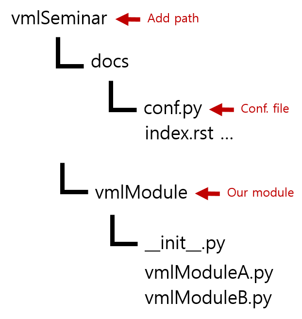

Autodoc
=========================================================

Create documentations of python project automatically by using annotations in the code.

Autodoc Settings
__________________________________________________________

- Activate autodoc extension

    - Open ``conf.py``
    - Find ``extensions`` and add autodoc extension: ``extensions = ['sphinx.ext.autodoc']``

.. note::
    For Sphinx(actually, the Python interpreter that executes Sphinx) to find your module, it must be importable. That means that the module or the package must be in one of the Python path.

.. warning::
    autodoc imports the modules to be documented. If any modules have side effects on import, these will be executed by autodoc.

- Add your module path to Python path

    - Open ``conf.py``
    - Find ``sys.path.insert`` and add your module path
    - ex) sys.path.insert(0, os.path.abspath('..'))

Autodoc docstrings
__________________________________________________________

- In your python code, put the annotations using specific format
- Two different docstring style (Sphinx syntax / Google style guide)

    - see :ref:`vmlModuleA-label`
    - ex) vmlModuleA.py

.. code-block:: Python

    def vmlModule_fuctionA(argA, argB) :
        """
        This function is vmlModule function A. Result is summation of input two arguments.

        :param argA: This is argument A.
        :param argB: This is argument B
        :return: argA+argB. Kids stuff.
        """
        return argA + argB

    def vmlModule_fuctionB(argA, argB) :
        """
        This function is vmlModule function B. Result is multiplication of input two arguments.

        Args:
            argA: This is argument A.

            argB: This is argument B.

        Returns:
            argA*argB. Much more difficult than function A!
        """
        return argA*argB

Autodoc modules
__________________________________________________________________________________

- Using ``.. automodule::`` in your .rst file

    - ex) ``vmlModuleA.rst`` file

::

    VML_Module_A
    -----------------------------------------------------

    .. automodule:: vmlModule.vmlModuleA
        :members:

- There there are various autodoc modules for the purpose.
- ex) ``.. autoclass::``, ``.. autofunction::``, ...
