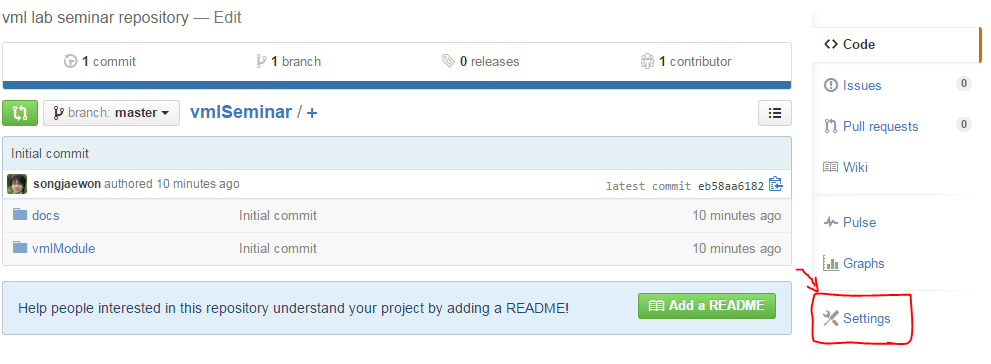

On-line build using Read the Docs
=====================================================

Github based explanation.

Github Repository
-----------------------------------------------------

- If you are not familiar with Git and Github, see Git-guide_
- Create your Github repository
- Push your Python project & Document files

    - Python modules
    - .rst files
    - ``_static`` folder (images)
    - ``conf.py``

- Add ReadTheDocs to Github services

    - In your repository, ``Settings`` >  ``Webhooks&Services`` > ``Add service`` > find ``ReadTheDocs``

Import the project into Read the Docs
-----------------------------------------------------

- Import your Github repository into your Read the Docs project.
- ``Read the Docs`` > ``Projects`` > ``Import a Project`` > ``Import from Github``

- Now, if you update your Github repository, Read the Docs creates your document automatically.

Apply Read the Docs Theme
________________________________________________________

You can change your document design style from basic sphinx theme to Read the Docs theme.

    - Open ``conf.py`` file.
    - Find ``html_theme`` and comment out it.
    - Add following code:

    .. code-block:: python

        # on_rtd is whether we are on readthedocs.org,
        #this line of code grabbed from docs.readthedocs.org
        on_rtd = os.environ.get('READTHEDOCS', None) == 'True'
        # only import and set the theme if we're building docs locally
        if not on_rtd:
            import sphinx_rtd_theme
            html_theme = 'sphinx_rtd_theme'
            html_theme_path = [sphinx_rtd_theme.get_html_theme_path()]

    - Now you can build your document as Read the Docs style

.. warning::
    External library dependency

        - If you use libraries or external modules for your project(ex. numpy, matplotlib, ...) Read the Docs on-line build system dosen't have the dependencies for building your project.
        - You can mock out the imports for these modules in your ``conf.py`` file with the following snippet:

        .. code-block:: python

            import sys
            from unittest.mock import MagicMock

            class Mock(MagicMock):
                @classmethod
                def __getattr__(cls, name):
                        return Mock()

            MOCK_MODULES = ['numpy', 'matplotlib']
            sys.modules.update((mod_name, Mock()) for mod_name in MOCK_MODULES)

.. _Git-guide: https://rogerdudler.github.io/git-guide/index.ko.html