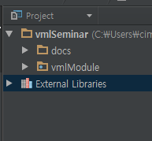

Installation of Read the Docs
=====================================================

Getting started with Read the Docs

- Install Sphinx (reference webpage_)
- Create a directory inside your project to hold your docs

- Run ``sphinx-quickstart`` in the directory
- Those things will be created

    - Configuration file(``conf.py``)
    - Initial .rst file (``index.rst``)
    - Offline make files(``Makefile``, ``make.bat``)
    - Folders(``_build``, ``_static``, ``_templates``, ...)

- Test off-line build the document

    - Run ``make html`` in the directory
    - HTML document will be created in ``docs/_build/html/``

.. _webpage: http://sphinx-doc.org/latest/install.html