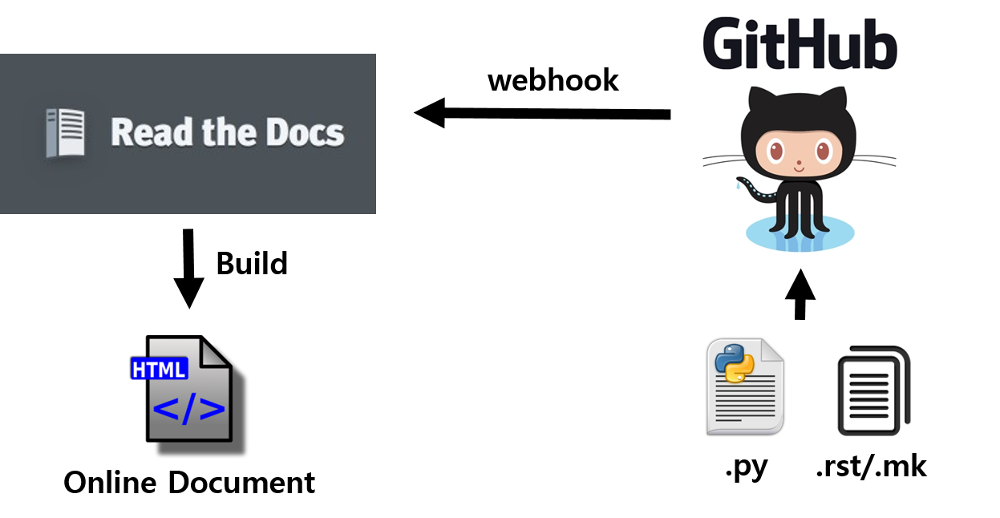
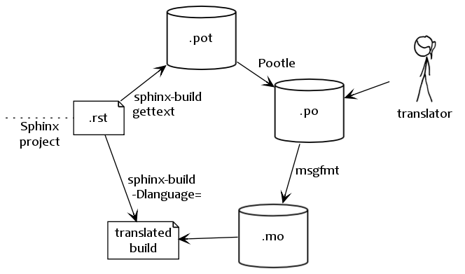

Features of Read the Docs
============================================

- Webhooks

  - Github, Bitbucket, ...
  - Github repository_ of this document
  - Read the docs project page_ of this document

- Build documentation in on-line environment
- HTML, PDF, EPUB format
- Localization of document
- Good looking at mobile environment

.. _repository: https://github.com/songjaewon/vmlSeminar
.. _page: https://readthedocs.org/projects/vmlseminar/