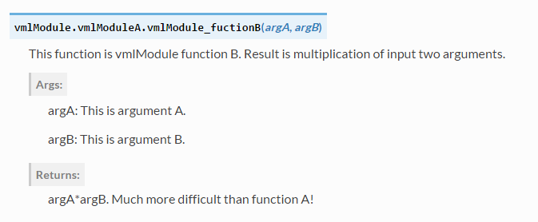

Sphinx
===========================================

- Document build system with mark-up language (reStructuredText / Markdown)
- Build documentation with various themes(style)
- Easy to version control

.. image:: _static/sphinx_overview.png
    :scale: 50%
    :align: center

reStructuredText / Markdown
____________________________________________

- Similar as HTML(HyperText Markup Language)
- Text, List, Hyperlink, Tables, Images, ...

.. image:: _static/sphinx_currentDocument.png
    :align: center

Autodoc of Sphinx
_____________________________________________

- Create document automatically based on the source code & annotations
- Using a certain annotation format

