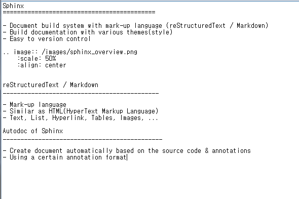

Sphinx
===========================================

- Document build system with mark-up language (reStructuredText / Markdown)
- Build documentation with various themes(style)
- Easy to version control

reStructuredText / Markdown
____________________________________________

- Similar as HTML(HyperText Markup Language)
- Text, List, Hyperlink, Tables, Images, ...

Autodoc of Sphinx
_____________________________________________

- Create document automatically based on the source code & annotations
- Using a certain annotation format

Source code

.. code-block:: python

    def vmlModule_fuctionB(argA, argB) :
    """
    This function is vmlModule function B. Result is multiplication of input two arguments.

    Args:
        argA: This is argument A.

        argB: This is argument B.

    Returns:
        argA*argB. Much more difficult than function A!
    """
    return argA*argB

Render result

.. autofunction:: vmlModule.vmlModuleA.vmlModule_fuctionB

